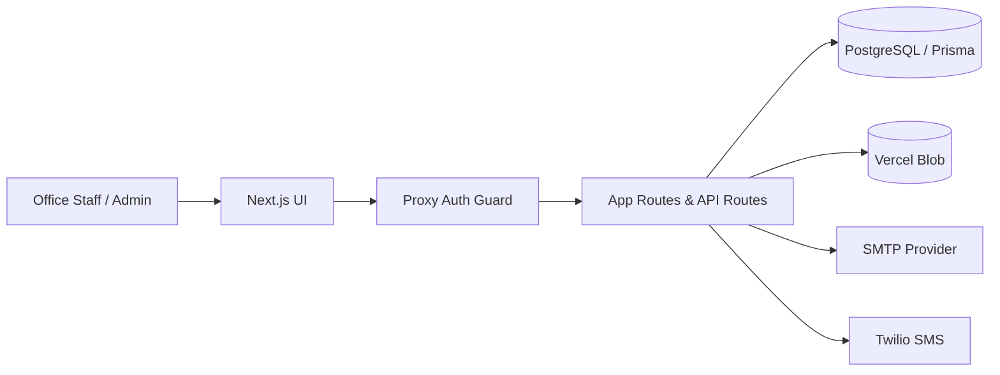
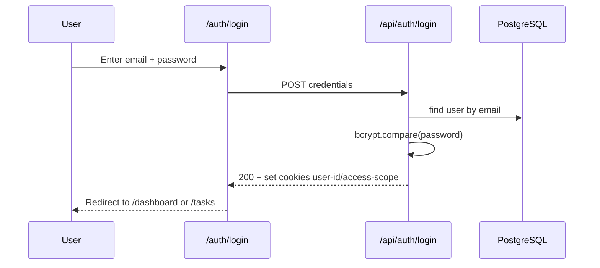
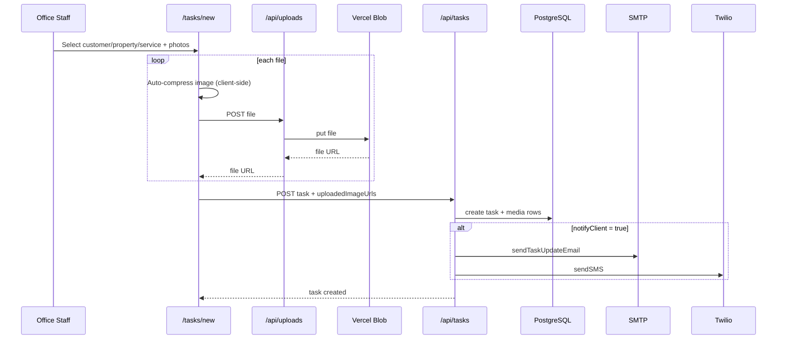
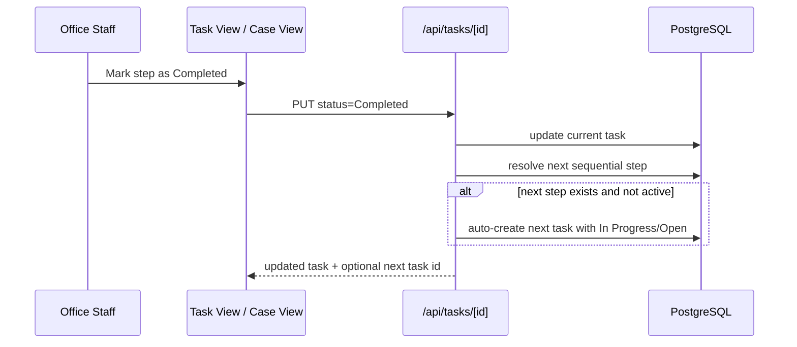

# Architecture Flows

## System context
Kline Task Manager is a Next.js 16 App Router application running on Vercel.
The platform manages tasks, customers, properties, services, statuses, and automated notifications.

Core runtime components:
- Web UI: Next.js pages under `src/app/*`
- Edge access control: `src/proxy.ts`
- API layer: `src/app/api/*`
- Persistence: PostgreSQL via Prisma
- File storage: Vercel Blob
- Notifications: SMTP email + Twilio SMS

## Request flow (high level)

## Authentication flow

## Task creation flow (with staged uploads)

## Sequential workflow flow (permits and other sequences)

## Access-scope flow
- `ALL`: full module access
- `PERMITS_ONLY`: restricted by `src/proxy.ts` and server checks in APIs
- Scope source of truth: latest `AuditLog` (`entity = USER_SCOPE`)

