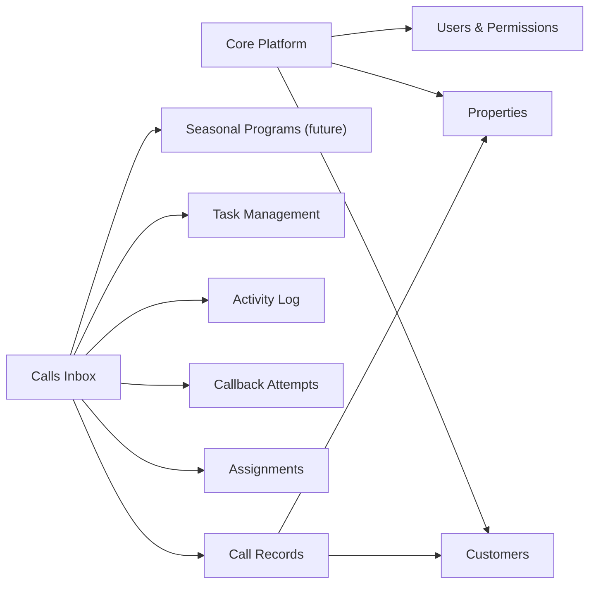

# Calls Inbox Blueprint

## Purpose

Create a new internal module to manage inbound call follow-up and callback accountability for Kline office staff.

The module should support:

- answered calls logged manually by office staff
- missed calls
- voicemails
- voicemail transcripts
- assignment and reassignment between office staff
- callback tracking
- complete status and activity history

This module is intended to solve the operational gap between receiving a call or voicemail and actually closing the follow-up.

## Core Architectural Decision

This should **not** be a voicemail-only module.

It should be a broader operational module:

- `Calls Inbox`

Because the office needs one shared workflow for:

- answered calls entered manually
- missed calls
- voicemail entries
- follow-up callbacks

All of those should live in the same intake and accountability system.

## Business Problems Solved

The module is meant to solve:

- missed callbacks
- unclear ownership of follow-up
- no visibility into pending call requests
- no history of reassignment or status changes
- no proof that callbacks happened
- scattered voicemail handling outside the system

## High-Level Architecture

Meaning:

- Calls Inbox shares customer and property data
- can link to tasks
- can later link to seasonal programs
- keeps its own workflow and operational history

## Main Entity

The central entity should be:

- `CallRecord`

Not `Voicemail`, because not every record is a voicemail.

## Source Types

Each call record should identify its origin:

- `ANSWERED_CALL`
- `VOICEMAIL`
- `MISSED_CALL`
- `MANUAL_ENTRY`
- `CALLBACK_ATTEMPT`

This keeps the module flexible and ready for future voicemail ingestion.

## Data Model

### CallRecord

#### Identification

- `id`
- `sourceType`
- `direction`
  - `INBOUND`
  - `OUTBOUND`
- `receivedAt`
- `phoneNumber`
- `extension` optional
- `callerNameRaw`
- `callerCompanyRaw`

#### Classification

- `callType`
  - `CUSTOMER_SERVICE`
  - `ESTIMATE_REQUEST`
  - `BILLING`
  - `VENDOR`
  - `MUNICIPAL`
  - `INTERNAL`
  - `RETAIL_QUESTION`
  - `UNKNOWN`
- `priority`
  - `LOW`
  - `MEDIUM`
  - `HIGH`
  - `URGENT`

#### Ownership

- `assignedToUserId`
- `assignedAt`
- `assignedByUserId`

#### Business Linking

- `customerId` optional
- `propertyId` optional
- `relatedTaskId` optional
- `relatedSeasonalEnrollmentId` optional later

#### Content

- `summary`
- `requestedAction`
- `internalNotes`
- `resolutionNotes`

#### Voicemail Content

- `audioUrl` optional
- `audioDurationSeconds` optional
- `transcriptRaw` optional

#### Extracted / Parsed Data

- `detectedAddress`
- `detectedTown`
- `detectedContactName`
- `detectedAlternatePhone`
- `detectedServiceCategory`
  - `POOL`
  - `IRRIGATION`
  - `MAINTENANCE`
  - `GENERAL`
- `detectedUrgencyReason`

### CallbackAttempt

- `id`
- `callRecordId`
- `attemptedByUserId`
- `attemptedAt`
- `outcome`
  - `NO_ANSWER`
  - `LEFT_VOICEMAIL`
  - `SPOKE_TO_CALLER`
  - `WRONG_NUMBER`
  - `CALL_BACK_LATER`
- `notes`
- `nextFollowUpAt` optional

### CallActivity

- `id`
- `callRecordId`
- `actionType`
  - `CREATED`
  - `STATUS_CHANGED`
  - `ASSIGNED`
  - `REASSIGNED`
  - `NOTE_ADDED`
  - `CALLBACK_LOGGED`
  - `LINKED_TO_CUSTOMER`
  - `LINKED_TO_PROPERTY`
  - `LINKED_TO_TASK`
  - `MARKED_RESOLVED`
  - `CLOSED`
- `fromValue` optional
- `toValue` optional
- `note`
- `createdByUserId`
- `createdAt`

## Status Model

Recommended statuses:

- `NEW`
- `TRIAGE_REQUIRED`
- `ASSIGNED`
- `CALLBACK_PENDING`
- `CALLBACK_ATTEMPTED`
- `WAITING_ON_CUSTOMER`
- `RESOLVED`
- `CLOSED`
- `SPAM`

These cover both answered calls and voicemails.

## Assignment Policy

### Default Rule

If an inbound voicemail or missed call does not clearly identify the responsible staff member, it should automatically be assigned to a configured office intake owner.

Suggested system setting:

- `defaultCallIntakeOwnerUserId`

This person becomes the first owner of ambiguous or untriaged inbound records.

### Operational Flow

1. voicemail or missed call enters the system
2. if no explicit owner is known, assign to office intake owner
3. office intake owner triages the record
4. office intake owner assigns or reassigns to the correct staff member
5. assignee performs callback and logs the result
6. call record is resolved and closed

### Email Notification Rule

Every initial assignment and every reassignment should trigger an internal email to the assignee.

The email should include:

- caller name or raw caller identity
- phone number
- short summary
- received time
- current status
- assigned by
- direct link to the call record

Recommended email events:

- first assignment
- reassignment
- optional overdue reminder later

## Required Fields for v1

The following should be required for first release:

- `sourceType`
- `receivedAt`
- `summary` or `transcriptRaw`
- `status`
- `assignedToUserId`

When available, also capture:

- `phoneNumber`
- `callerNameRaw`
- `callType`
- `priority`

## User Experience Blueprint

### Calls Inbox

Main table with filters:

- status
- assigned to
- priority
- call type
- detected service category
- has voicemail
- unassigned only
- unresolved only

Columns:

- received at
- caller
- phone
- type
- assigned to
- status
- priority
- linked customer/property
- actions

### Call Detail

The main working screen.

Sections:

- caller information
- summary
- transcript / voicemail content
- linked customer/property/task
- status and assignment
- callback attempts
- internal notes
- activity timeline

### My Follow-Ups

User-specific working queue:

- assigned to me
- callback pending
- overdue
- unresolved

### Call Dashboard

KPIs:

- new today
- callback pending
- overdue
- resolved today
- average callback time
- unassigned calls

## User Actions

Users should be able to:

- create answered call manually
- create voicemail record manually
- paste transcript manually
- attach or reference voicemail audio
- assign
- reassign
- change status
- log callback attempt
- add note
- link customer/property/task
- mark resolved
- close

## Permissions

Recommended permission set:

- `VIEW_CALLS`
- `MANAGE_CALLS`
- `ASSIGN_CALLS`
- `RESOLVE_CALLS`
- `VIEW_CALL_RECORDINGS`

Possible access behavior:

- viewer: read only
- office staff: create and update records, assign and reassign
- manager/admin: full access

## Voicemail Readiness

The system should be ready now for next week’s voicemail recording and transcription flow.

That means v1 should support:

- manual creation of voicemail records
- manual transcript paste
- optional audio file or URL reference
- parsed or summarized content
- assignment and callback workflow

Automation can come later without redesigning the data model.

## Delivery Roadmap

### Phase 1

- module shell
- permissions
- manual call records
- assignment and reassignment
- statuses
- callback attempts
- activity history

### Phase 2

- voicemail transcript workflow
- audio reference support
- helper fields for extracted information

### Phase 3

- Xfinity voicemail ingestion process
- semi-automated transcription intake
- customer/property matching suggestions

### Phase 4

- tighter integration with tasks and seasonal programs
- SLA reporting
- manager dashboard metrics

## Recommendation

The recommended approach is:

- build `Calls Inbox`
- support answered calls and voicemails from day one
- make ownership and callback tracking the operational core
- keep ingestion manual first
- prepare the model now for voicemail recordings and transcripts

This gives Kline a controlled follow-up system immediately while keeping the design open for future automation.
