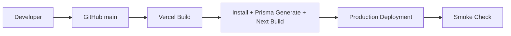

# DevOps Blueprint

## Current operating model
- Hosting: Vercel
- Source control: GitHub (`main` deploy branch)
- Framework: Next.js 16 + TypeScript
- Data: PostgreSQL (Neon) via Prisma
- Storage: Vercel Blob
- Messaging: Office365 SMTP + Twilio

## Deployment pipeline

## Environment blueprint
- Local:
  - `.env` with DB + email + Twilio + blob token
  - `npm run dev`
- Production:
  - Vercel project env vars
  - Auto-deploy from `main`

## Required environment variables
- `DATABASE_URL`
- `EMAIL_HOST`
- `EMAIL_PORT`
- `EMAIL_USER`
- `EMAIL_PASS`
- `EMAIL_FROM`
- `TWILIO_ACCOUNT_SID`
- `TWILIO_AUTH_TOKEN`
- `TWILIO_PHONE_NUMBER`
- Vercel Blob token vars (project-managed in Vercel)

## Operational checks per deployment
- Build passes (`next build --webpack`)
- Login works (`/auth/login`)
- Task create works (with and without attachments)
- Sequential progression works (complete step -> next step auto-created)
- Notification paths verified (email/SMS for statuses with `notifyClient=true`)

## Recommended hardening backlog
- Add CI gate before deploy:
  - `npx tsc --noEmit`
  - `npm run lint`
  - basic API smoke tests
- Add production error tracking and alerting
- Add database backup/restore runbook
- Add release checklist and rollback checklist

## Rollback strategy
- Use Vercel deployment history to promote last known good deployment
- If schema changes are introduced in the future, version Prisma migrations and include rollback notes per release

