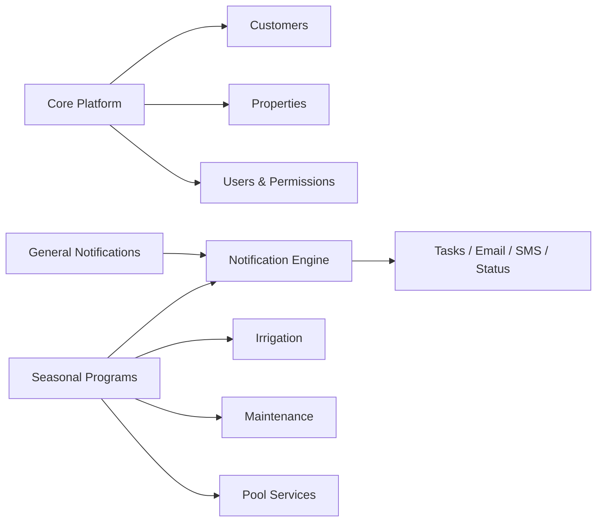

# Seasonal Programs Blueprint

## Purpose

Extend the Kline Task Notification System into a broader operational platform by introducing a new module for recurring seasonal services that are currently managed in Excel.

This module will centralize operational control for:

- Irrigation
- Maintenance
- Pool Services

The existing task system remains the general notification engine for permits, ad hoc updates, and client communication.

## Core Architectural Decision

The platform should separate:

- `Task Management`: general notifications, permits workflows, attachments, notes, resend actions
- `Seasonal Programs`: recurring operational service control, rosters, occurrences, issues, and scheduling

Both modules should share:

- Customers
- Properties
- Users and permissions
- Notification delivery services

## High-Level Architecture

## Business Scope

The new module is designed to replace operational use of the following workbooks:

- `/Users/mariorico/Downloads/IRRIGATION 2024 .xlsx`
- `/Users/mariorico/Downloads/2024 MAINTENANCE.xlsx`
- `/Users/mariorico/Downloads/2024 POOL SERVICE.xlsx`

Initial import scope should focus on active 2026 sheets:

- `2026  IRRIGATION`
- `2026 CLEAN UPS`
- `2026 MAIN LIST`

## Core Domain Concepts

### Program

A top-level service domain.

Examples:

- Irrigation
- Maintenance
- Pool Services

### ProgramSeason

A program within a defined operational year or season.

Examples:

- Irrigation 2026
- Maintenance 2026
- Pool Services 2026

### Enrollment

A property participating in a program season.

Examples:

- `300 compass rd` enrolled in `Pool Services 2026`
- `13 W 6TH ST` enrolled in `Irrigation 2026`

This becomes the primary operational record.

### EnrollmentService

A specific service component included in the enrollment.

Examples:

- Irrigation:
  - Turn On
  - Turn Off
- Maintenance:
  - Spring Cleanup
  - June
  - July
  - Fall
  - Weed Control
- Pool:
  - Open
  - Close
  - Weekly
  - Additional Before
  - Additional After

### Occurrence

A scheduled or completed operational event.

Examples:

- Turn On visit
- Weekly pool visit
- July maintenance visit
- Fall cleanup visit

### Issue

An operational exception, repair, or service problem.

Examples:

- Irrigation repair
- Pool problem
- Access issue
- No water / no power
- Customer callback needed

## Proposed Data Model

### Program

- `id`
- `name`
- `code`
- `active`

### ProgramSeason

- `id`
- `programId`
- `label`
- `year`
- `startsAt`
- `endsAt`
- `status`

### Enrollment

- `id`
- `programSeasonId`
- `customerId`
- `propertyId`
- `invoiceNumber`
- `town`
- `primaryPhone`
- `primaryEmail`
- `accessCode`
- `serviceNotes`
- `operationalNotes`
- `status`
- `createdAt`
- `updatedAt`

### EnrollmentService

- `id`
- `enrollmentId`
- `serviceType`
- `isIncluded`
- `targetDate`
- `completionDate`
- `status`
- `notes`

### Occurrence

- `id`
- `enrollmentId`
- `enrollmentServiceId`
- `scheduledFor`
- `completedAt`
- `status`
- `assignedTo`
- `notes`
- `createdBy`
- `updatedBy`

### Issue

- `id`
- `enrollmentId`
- `category`
- `priority`
- `description`
- `status`
- `openedAt`
- `resolvedAt`
- `notes`

### Notification Linkage

Tasks remain independent but may optionally reference their origin.

Recommended task source types:

- `GENERAL`
- `SEASONAL_OCCURRENCE`
- `SEASONAL_ISSUE`

Optional linkage fields:

- `programOccurrenceId`
- `programIssueId`

## Mapping from Current Excel Structure

### Irrigation

Primary operational sheet:

- `2026  IRRIGATION`

Interpretation:

- Each row becomes an `Enrollment`
- `TURN ON` and `TURN OFF` become `EnrollmentService` records
- Codes and access notes map to operational fields on the enrollment

Additional sheets:

- `REPAIRS-SERVICE CALLS`
- `COMPLETED REPAIRS`

Interpretation:

- Active or historical `Issue` data

### Maintenance

Primary operational sheet:

- `2026 CLEAN UPS`

Interpretation:

- Each row becomes an `Enrollment`
- Seasonal/monthly columns become separate `EnrollmentService` records

Examples:

- Spring
- April
- May
- June
- July
- August
- September
- October
- Fall
- Weed Control
- Weekly Grass Cuts

### Pool Services

Primary operational sheet:

- `2026 MAIN LIST`

Interpretation:

- Each row becomes an `Enrollment`
- Open / close / weekly / additional before / additional after become `EnrollmentService` records

Additional issue sheets:

- `POOL PROBLEMS`
- `2026 REPAIRS`

Interpretation:

- `Issue`

## User Experience Blueprint

### Programs Dashboard

Purpose:

- Entry point into Seasonal Programs

Displays:

- Irrigation 2026
- Maintenance 2026
- Pool Services 2026

KPIs:

- Active enrollments
- Due this week
- Overdue
- Open issues

### Program Roster

Purpose:

- Master operational table for one program season

Columns:

- Customer
- Property
- Town
- Package summary
- Next due
- Last completed
- Open issues
- Actions

Filters:

- Town
- Service type
- Due this week
- Overdue
- Has issues
- Active/inactive

### Enrollment Detail

Purpose:

- Single-property operational control center

Sections:

- Customer / property summary
- Contracted services
- Operational notes / access / code
- Upcoming occurrences
- Completed occurrences
- Issues / repairs
- Notification history

### Execution View

Purpose:

- Daily operational view by program

Examples:

- Irrigation:
  - Turn On
  - Turn Off
  - Repairs
- Maintenance:
  - Spring
  - Monthly
  - Fall
- Pool:
  - Open
  - Weekly
  - Close
  - Repairs

## Permissions and Security

Seasonal Programs must be visible only to selected users.

The current user access model already supports:

- access scope restrictions
- planner access

But Seasonal Programs will require a more explicit permission model.

### Recommended Permissions

- `VIEW_TASKS`
- `MANAGE_TASKS`
- `SEND_NOTIFICATIONS`
- `VIEW_PLANNER`
- `VIEW_SEASONAL_PROGRAMS`
- `MANAGE_SEASONAL_PROGRAMS`
- `IMPORT_SEASONAL_PROGRAMS`
- `MANAGE_USERS`
- `MANAGE_SERVICES`
- `MANAGE_STATUSES`

### Enforcement Rules

Permissions must be enforced in:

- Navigation visibility
- Route protection
- API authorization
- Import workflows

### Access Levels

Suggested examples:

- Admin:
  - Full access
- Office Manager:
  - View and manage seasonal programs
  - Send notifications
- Operations Staff:
  - View seasonal programs
  - Manage occurrences and issues
- Viewer:
  - Read-only access where allowed

## Relationship to Existing Notifications

Not all notifications belong to seasonal programs.

Therefore:

- `Task Management` remains first-class
- `Seasonal Programs` only creates notifications when needed
- Ad hoc notifications stay independent

Examples:

- Permit updates remain task-driven
- Ad hoc homeowner updates remain task-driven
- Irrigation turn-on completion may generate a notification
- Pool repair issue may generate a notification

## Migration Strategy

### Phase 1 Import

Import only active operational sheets:

- `2026  IRRIGATION`
- `2026 CLEAN UPS`
- `2026 MAIN LIST`

### Phase 2 Import

Import active issue sheets:

- Irrigation repairs/service calls
- Pool problems/repairs

### Phase 3

Consider historical import only if there is clear business value.

### Guiding Principle

The objective is not to recreate every spreadsheet tab.

The objective is to extract business meaning from the spreadsheets and move that meaning into durable application structures.

## Key Risks

### Customer and Property Matching

Potential mismatch between:

- Excel names
- Current customer records
- Property records
- Address and town formatting

### Unstructured Notes

Operational logic currently lives in free text:

- Access instructions
- Water status
- Scheduling notes
- Customer requests

### Multi-Service Cells

Some cells mix:

- Included service
- Timing
- Status
- Free-form notes

### Date Normalization

The spreadsheets contain Excel serial dates and mixed text dates that will require careful normalization.

### Scope Creep

Trying to replace every spreadsheet behavior at once will make the first release too large and too fragile.

## Recommended Delivery Phases

### Phase 0: Security Foundation

- Introduce explicit permissions for Seasonal Programs
- Protect navigation, routes, and APIs

### Phase 1: Core Domain

- Program
- ProgramSeason
- Enrollment
- EnrollmentService
- Issue

### Phase 2: UI MVP

- Programs Dashboard
- Program Roster
- Enrollment Detail

### Phase 3: Import MVP

- Import 2026 irrigation
- Import 2026 maintenance
- Import 2026 pool

### Phase 4: Notification Integration

- Allow occurrences/issues to generate tasks and notifications

### Phase 5: Execution Views

- Operational boards
- Due and overdue views
- Improved issue management

## Recommendation

This initiative is feasible and strategically strong.

The recommended approach is:

- Keep tasks for communication
- Build Seasonal Programs for recurring operations
- Connect both through controlled notification linkage
- Protect the new module through explicit user permissions

This turns the platform into a shared operational system rather than a notification-only tool, while preserving the strengths of the current architecture.
