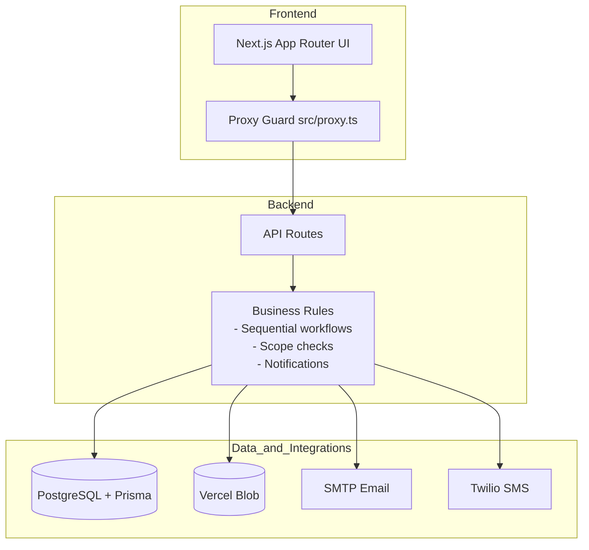
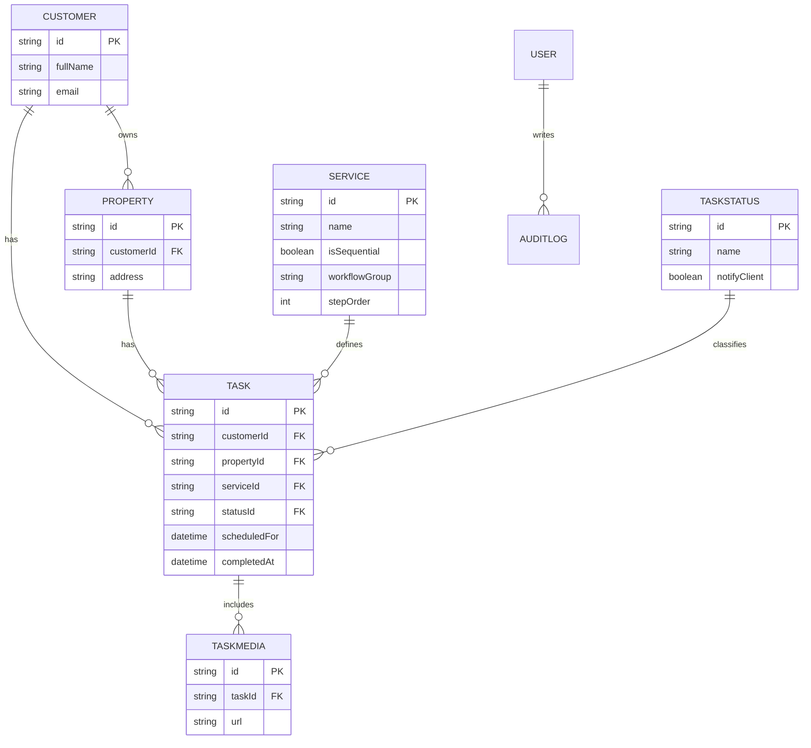
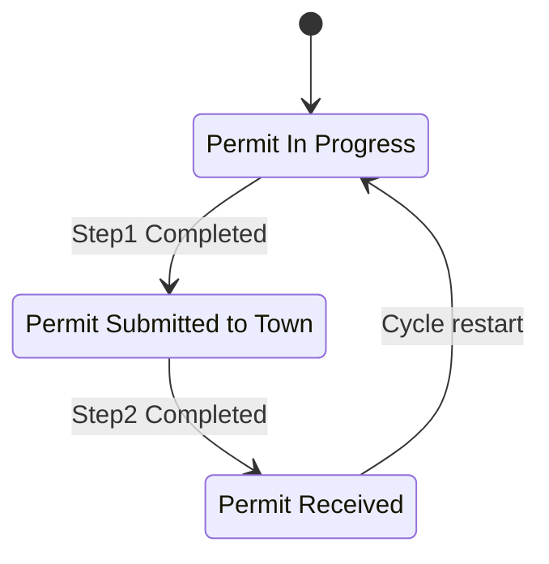
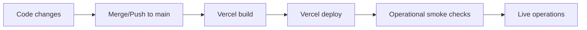

# Visual Diagrams

## 1) Logical architecture

```mermaid
flowchart TB
  subgraph Frontend
    UI[Next.js App Router UI]
    PX[Proxy Guard src/proxy.ts]
  end

  subgraph Backend
    API[API Routes]
    SVC[Business Rules\n- Sequential workflows\n- Scope checks\n- Notifications]
  end

  subgraph Data_and_Integrations
    DB[(PostgreSQL + Prisma)]
    BL[(Vercel Blob)]
    EM[SMTP Email]
    TW[Twilio SMS]
  end

  UI --> PX --> API --> SVC
  SVC --> DB
  SVC --> BL
  SVC --> EM
  SVC --> TW
```

## 2) Task domain model (simplified)

```mermaid
erDiagram
  CUSTOMER ||--o{ PROPERTY : owns
  CUSTOMER ||--o{ TASK : has
  PROPERTY ||--o{ TASK : has
  SERVICE ||--o{ TASK : defines
  TASKSTATUS ||--o{ TASK : classifies
  TASK ||--o{ TASKMEDIA : includes
  USER ||--o{ AUDITLOG : writes

  CUSTOMER {
    string id PK
    string fullName
    string email
  }

  PROPERTY {
    string id PK
    string customerId FK
    string address
  }

  SERVICE {
    string id PK
    string name
    boolean isSequential
    string workflowGroup
    int stepOrder
  }

  TASKSTATUS {
    string id PK
    string name
    boolean notifyClient
  }

  TASK {
    string id PK
    string customerId FK
    string propertyId FK
    string serviceId FK
    string statusId FK
    datetime scheduledFor
    datetime completedAt
  }

  TASKMEDIA {
    string id PK
    string taskId FK
    string url
  }
```

## 3) Permits stage progression

```mermaid
stateDiagram-v2
  [*] --> Step1
  Step1: Permit In Progress
  Step2: Permit Submitted to Town
  Step3: Permit Received

  Step1 --> Step2: Step1 Completed
  Step2 --> Step3: Step2 Completed
  Step3 --> Step1: Cycle restart
```

## 4) Production delivery lifecycle

```mermaid
flowchart LR
  C[Code changes] --> M[Merge/Push to main]
  M --> VB[Vercel build]
  VB --> VD[Vercel deploy]
  VD --> QA[Operational smoke checks]
  QA --> Ops[Live operations]
```

